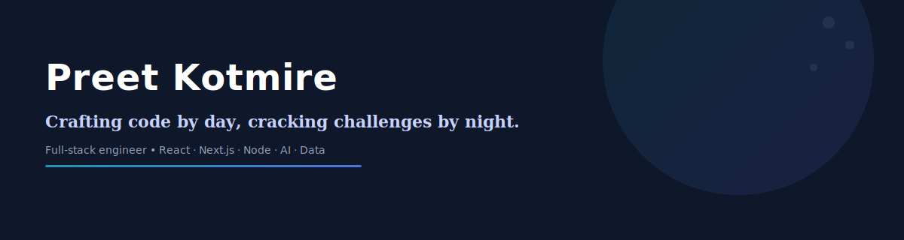

  

# Preet Kotmire

Crafting code by day, cracking challenges by night.

---

I am a full-stack Software Engineer passionate about building scalable, responsive, and user-centric web applications. Skilled in React, Next.js, Tailwind CSS, HTML, CSS, JavaScript, MongoDB, PostgreSQL, and experienced with MERN stack development, Express.js, Firebase Auth, and ORMs. I focus on delivering clean, efficient code and seamless digital experiences. I'm expanding my expertise in cloud technologies, API development, and data science with hands-on experience in Python and data tools.

[Get Resume](https://preetkotmirefr.vercel.app/PreetKotmireResume.pdf) • [Email](mailto:preet.sk18@gmail.com) • [GitHub](https://github.com/PreetKot)

---

## Selected Projects

- **Quick Court** — Real-time multi-sport court booking platform with transactional locking and conflict-free scheduling.
- **Droply** — Secure file storage and sharing system inspired by Dropbox; focused on access controls and simple UX.
- **FinTrack** — Privacy-first finance tracker with AI-powered categorization and insights.
- **Persona-Driven Document Intelligence** — Offline PDF intelligence tool that extracts persona- and task-specific insights.

Each project has tests, deployment notes, and a short walkthrough — ping me if you want direct links.

---

## Skills & Tools

- Frontend: React, Next.js, TypeScript, Tailwind CSS, Bootstrap, HTML, CSS
- Backend: Node.js, Express, MongoDB, PostgreSQL, Prisma
- Languages: JavaScript, TypeScript, Python, C++, C
- Tools: Git, Docker, Vercel, Netlify, VS Code

---

## Experience & Education (short)

- Secretary — GameDevUtopia (2025–26) — led event coordination for 100+ students.
- Web Development Intern — Gharpan NGO (2025, ongoing) — built scalable orphanage management workflows.
- Incoming Summer Intern — BNY (2026)

- BE Electronics & Telecommunication — Pune Institute of Computer Technology (2023–2027) — CGPA 9.28

---

## Awards

- 2nd Runner-up — Abhivyakti (National Paper Presentation)
- Finalist — Odoo Hackathon 2025 (top 20 of ~19,000)

---

If you'd like, I can:

- Add per-project links, screenshots and quick demos
- Export this README as a compact GitHub profile bio
- Optimize and convert GIF banners to webp for faster loading

---

<!-- Profile README: end -->
